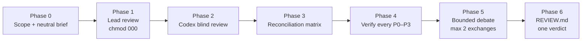
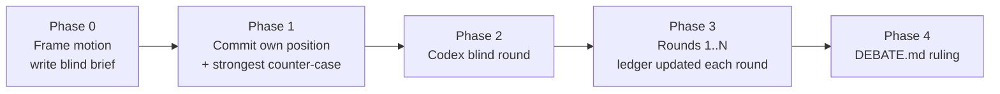

<div align="center">

# claude-codex-duo

**Claude Code and OpenAI Codex as an adversarial pair: blind two-model code review and structured debate, with evidence on disk.**

[](LICENSE)
[](https://docs.anthropic.com/en/docs/claude-code)
[](https://github.com/openai/codex)
[](#safety-guarantees)

</div>

---

## Table of contents

- [Why](#why)
- [What is in the box](#what-is-in-the-box)
- [Prerequisites](#prerequisites)
- [Installation](#installation)
- [Quick start](#quick-start)
- [How it works](#how-it-works)
  - [codex-pr-review](#codex-pr-review)
  - [codex-debate](#codex-debate)
  - [Reviewing uncommitted changes](#reviewing-uncommitted-changes)
  - [The monitored runner](#the-monitored-runner)
- [Artifacts](#artifacts)
- [Safety guarantees](#safety-guarantees)
- [Troubleshooting](#troubleshooting)
- [FAQ](#faq)
- [Contributing](#contributing)
- [License](#license)

---

## Why

A single model reviewing code tends to agree with itself. Asking the same model twice does not help, and asking a second model without discipline produces a second opinion with no way to tell who is right.

These plugins make the second model useful by forcing structure around it:

- **Blind first pass.** Codex forms its view from the code alone; it is never told another reviewer exists.
- **Every claim is checked.** Agreement between the two models is not evidence. Every finding of severity P0 to P3 is verified against the code, whoever raised it.
- **Written trail.** Every phase writes an artifact. The verdict follows from the ledger and a fixed policy, not from whoever spoke last.
- **Nothing is touched.** Both plugins are strictly read-only, including when reviewing uncommitted work.

## What is in the box

| Plugin | Purpose | Entry point |
|---|---|---|
| **codex-pr-review** | Two-model code review of a PR, branch, commit range, or uncommitted local changes. Ends in exactly one merge decision. | `/codex-pr-review:review-pr <target> <base> "<intent>"` |
| **codex-debate** | Adversarial debate on any falsifiable motion or choice between named options: architecture decisions, migration plans, root-cause hypotheses, disputed review findings. | `/codex-debate:debate "<motion>" <mode> <rounds> [--seed <file>]` |

Both plugins also trigger from plain language ("review PR 123 with Codex", "debate with Codex whether ...").

## Prerequisites

| Requirement | Notes |
|---|---|
| Claude Code | With plugins enabled |
| OpenAI Codex plugin | `claude plugin install codex@openai-codex`, then `/codex:setup` and log in. Both plugins drive Codex through that plugin's companion script in its read-only sandbox. |
| `git`, `python3`, `node` | Standard tooling; macOS and Linux |

Sending repository content to Codex means sending it to OpenAI. Both plugins ask for confirmation that this is permitted for the repository before the first Codex call.

## Installation

```bash
claude plugin marketplace add hishamkaram/claude-codex-duo
claude plugin install codex-pr-review@claude-codex-duo --scope user
claude plugin install codex-debate@claude-codex-duo --scope user
```

Install only the one you need; each plugin is standalone.

Update later:

```bash
claude plugin marketplace update claude-codex-duo
claude plugin update codex-pr-review@claude-codex-duo
claude plugin update codex-debate@claude-codex-duo
```

## Quick start

```text
# Review a GitHub PR; intent is taken from the PR body
/codex-pr-review:review-pr 123 main "PR body"

# Review a branch against main with an explicit spec
/codex-pr-review:review-pr feature/rate-limit origin/main "implements ADR-007 token bucket"

# Review a single commit against its parent
/codex-pr-review:review-pr 1965c8f6 1dfbaf4e "commit message of 1965c8f6"

# Review uncommitted work: staged, unstaged, deleted and untracked files
/codex-pr-review:review-pr local HEAD "settlement preflight for enable/disable"

# Have Codex attack a position
/codex-debate:debate "The per-tenant cache must be keyed by tenant+region, not tenant alone" challenge 3

# Compare named options; both sides argue blind first
/codex-debate:debate "Option A: Redis streams vs Option B: Postgres outbox for the job queue" compare 2

# Debate a disputed review finding, seeded with the review's verification record
/codex-debate:debate "F-01 stale replay is P1, not P2" hypothesis 2 \
  --seed /tmp/two-model-pr-review/<repo>/<run>/04-verification.md
```

## How it works

### codex-pr-review



1. **Scope and brief.** Base and head are pinned to immutable SHAs. A neutral brief for Codex is generated deterministically by `build-brief.sh` before any finding exists; it contains the diff command, the alphabetical file list, the stated intent, the conventions, and the review rubric. It never mentions a second reviewer.
2. **Lead review.** Claude reviews in two passes (design, then implementation) against the rubric, writes its findings, and immediately sets the file to mode 000.
3. **Codex blind review.** A pre-flight asserts the lead file is unreadable, then the monitored runner launches Codex in a fresh thread, read-only, from the brief. Raw output and job metadata are kept verbatim.
4. **Reconciliation.** Every distinct finding from both sides is tabled as BOTH, CLAUDE-ONLY, CODEX-ONLY, or CONFLICT and given one canonical severity.
5. **Verification.** Each P0 to P3 finding and each CONFLICT is checked up an evidence ladder: quoted code, traced call path, executed test or repro. CODEX-ONLY findings get the same rigor as Claude's own.
6. **Bounded debate.** Only still-unverifiable or conflicting items go back to Codex, at most twice. Positions move only for new code-level evidence.
7. **Report.** `REVIEW.md` carries the verdict under an ordered, exclusive policy (BLOCK, REQUEST CHANGES, NEEDS CLARIFICATION, APPROVE WITH COMMENTS, APPROVE), merge conditions by finding ID, a disagreement log with job IDs, a false-positive appendix, and a coverage statement. Anything left unresolved is printed as a ready-to-run `/debate` line.

If Codex is unavailable the review continues as a single-model review, says so on line one, and never raises confidence to compensate.

### codex-debate



- **Motion discipline.** The motion must be a falsifiable statement or a choice between named options. Vague questions are rewritten and confirmed first.
- **Modes.** `challenge` (Codex attacks Claude's position), `compare` (named options, both sides argue independently before seeing each other), `hypothesis` (root-cause debate against a failure).
- **Claim ledger.** Every claim has an owner, an ID, an evidence grade (E0 executed, E1 quoted trace, E2 cited document, E3 reasoning, E4 assertion) and a status. E4 claims can never decide a ruling.
- **Rules that bind both sides.** Positions move only for new evidence. Contested checkable facts are checked, not argued. Conceding to end the debate is a logged failure.
- **Ruling.** UPHELD, OVERTURNED, REFINED, UNRESOLVED, or NO DEBATE, with mandatory sections for Claude's own concessions and the strongest surviving argument against the ruling.

### Reviewing uncommitted changes

Passing `local` (or `worktree`) as the target reviews the working tree as it is, without committing or stashing:

- The builder captures staged, unstaged, deleted, renamed and non-ignored untracked files into a single git **tree object** through a scratch index that lives in the artifact directory, never in the repository. The repository's own index, refs, stash, reflog and files are untouched; the only side effect is unreachable objects in `.git/objects`.
- The brief's diff command becomes `git diff <base> <tree>`; Codex reads files exactly as reviewed with `git show <tree>:<path>`.
- Base defaults to `HEAD`. A clean tree stops with "nothing to review".
- The tree is resolved immediately before and after the Codex run, and recaptured at the end. If it changed, the report names the files edited during the review.

### The monitored runner

Every Codex call goes through `scripts/codex-run.sh`, which wraps the Codex plugin's background task mode:

| Behaviour | Detail |
|---|---|
| Background execution | Never a foreground call, so long reviews cannot be killed by shell timeouts |
| Liveness | Polls job status and the worker process; a dead worker with a "running" job is detected and cancelled |
| Stall and timeout | Configurable (`--stall-min`, `--max-min`); a stall or timeout cancels the job, then verifies the cancel by re-reading job status and looking for a live worker. An unverified cancel is reported, never asserted. |
| Evidence | Raw stdout, stderr, job log, progress and metadata (job ID, thread ID, timings, last error) saved as sidecars; retries rotate to `.attemptN.*` |
| Refusals | Exits immediately if `--write` is requested |
| Probe | `--probe` checks the Codex plugin is installed, logged in and ready before a review spends any effort |

Exit codes: `0` completed, `1` failed, `2` stalled, `3` timeout, `4` launch error or invalid invocation, `5` stalled or timed out with the cancel unconfirmed. A bad command line never exits 1, so a typo cannot be mistaken for an upstream failure, and `5` means do not retry because a worker may still be running.

## Artifacts

Everything is written outside the repository:

```text
/tmp/two-model-pr-review/<repo>/<target>-<timestamp>/
  00-scope.md  00-brief.md  01-lead.md  02-codex.md (+ .stdout .stderr .joblog .meta)
  03-matrix.md  04-verification.md  05-debate.md  REVIEW.md

/tmp/codex-debate/<repo>/<motion-slug>-<timestamp>/
  00-frame.md  01-claude-position.md  02-codex-blind.md  03-round-<k>.md  DEBATE.md
```

Each artifact ends with a `STATUS: PHASE <n> COMPLETE` line; a run resumes at the first missing artifact.

## Safety guarantees

- **Read-only.** Neither plugin modifies, formats, stages, stashes, commits or restores tracked files, and Codex is never invoked with `--write`. `git status` must match the starting baseline at the end of every run.
- **Untrusted input.** Repository content, PR text and Codex output are treated as data, never as instructions.
- **No fabricated evidence.** A command that did not run is never reported as run; failures are reported verbatim.
- **Blindness is procedural, not structural.** Codex's sandbox can read `/tmp` and Claude Code session transcripts. What keeps the second review blind is that Codex is never told a first review exists, that Claude's findings are written before any Codex contact, and that they sit at mode 000 while Codex runs. Reports say exactly this and never claim more.

## Troubleshooting

| Symptom | Cause and fix |
|---|---|
| `PROBE` reports UNAVAILABLE | The Codex plugin is not installed or not logged in. Run `/codex:setup`. |
| Runner exit `5` | The job stalled or timed out and the cancel could not be confirmed. Do not retry; check the job with the companion's `status` command, because a worker may still be running. |
| Runner exit `2` (STALLED) | No job-log activity for `--stall-min` minutes. Check the `.joblog` sidecar; upstream capacity errors are recorded in `.meta` as `last_error`. Rerun; attempts rotate. |
| Runner exit `3` (TIMEOUT) | Review exceeded `--max-min`. Large diffs should be split by subsystem in Phase 0. |
| "nothing to review" in local mode | The working tree equals the base tree. Make a change or pick a different base. |
| Builder refuses `--out` | The artifact directory must be outside the repository so the scratch index cannot leak into the snapshot. |
| Tests fail inside a monorepo repro | Build workspace dependencies first; stale `dist` output is the usual cause. |

## FAQ

**Does the debate plugin need the review plugin?** No. It debates any motion. `--seed` is an optional way to import a review's verification record.

**Can I use a Claude subagent instead of Codex?** No. Both plugins refuse to simulate the second model; a same-model second opinion is exactly the failure mode they exist to avoid.

**Does local mode work on Windows?** Untested. macOS and Linux are supported.

**Where do secrets go?** Nowhere. Briefs never contain credentials, and the read-only sandbox prevents Codex from writing anything back.

## Contributing

See [CONTRIBUTING.md](CONTRIBUTING.md). Run `bash scripts/validate.sh` before opening a PR; CI runs it too. Changes must keep both plugins read-only and must not add any wording that would tell Codex a second reviewer exists.

## License

[MIT](LICENSE)
