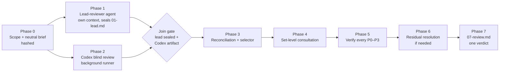
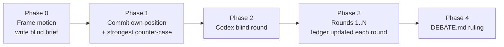
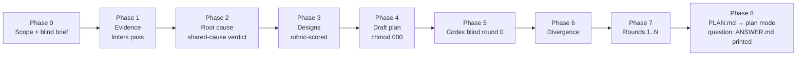

<div align="center">

# claude-codex-duo

**Claude Code and OpenAI Codex as an adversarial pair: blind two-model code review, structured debate, and evidence-only deep planning, with evidence on disk.**

[](LICENSE)
[](https://docs.anthropic.com/en/docs/claude-code)
[](https://github.com/openai/codex)
[](#safety-guarantees)

</div>

---

## Table of contents

- [Why](#why)
- [What is in the box](#what-is-in-the-box)
- [Prerequisites](#prerequisites)
- [Installation](#installation)
- [Quick start](#quick-start)
- [How it works](#how-it-works)
  - [codex-pr-review](#codex-pr-review)
  - [codex-debate](#codex-debate)
  - [codex-deep-plan](#codex-deep-plan)
  - [Reviewing uncommitted changes](#reviewing-uncommitted-changes)
  - [The monitored runner](#the-monitored-runner)
- [Artifacts](#artifacts)
- [Safety guarantees](#safety-guarantees)
- [Troubleshooting](#troubleshooting)
- [FAQ](#faq)
- [Contributing](#contributing)
- [License](#license)

---

## Why

A single model reviewing code tends to agree with itself. Asking the same model twice does not help, and asking a second model without discipline produces a second opinion with no way to tell who is right.

These plugins make the second model useful by forcing structure around it:

- **Blind first pass.** Codex forms its view from the code alone; it is never told another reviewer exists.
- **Every claim is checked.** Agreement between the two models is not evidence. Every finding of severity P0 to P3 is verified against the code, whoever raised it.
- **Written trail.** Every phase writes an artifact. The verdict follows from the ledger and a fixed policy, not from whoever spoke last.
- **The checkout is never modified.** Tracked files, the index, refs, stash and reflog are untouched by every plugin, including when reviewing uncommitted work: artifacts go outside the repository, local review adds only unreachable objects to `.git/objects`, and deep-plan writes one plan-mode plan file for Claude Code.

## What is in the box

| Plugin | Purpose | Entry point |
|---|---|---|
| **codex-pr-review** | Two-model code review of a PR, branch, commit range, or uncommitted local changes: a lead-reviewer agent and Codex review the same brief concurrently and blind, then conduct a bounded set-level consultation before evidence-based verification. Ends in exactly one merge decision. | `/codex-pr-review:review-pr <target> <base> "<intent>" [--workflow]` |
| **codex-debate** | Adversarial debate on any falsifiable motion or choice between named options: architecture decisions, migration plans, root-cause hypotheses, disputed review findings. | `/codex-debate:debate "<motion>" <mode> <rounds> [--seed <file>]` |
| **codex-deep-plan** | Evidence-only planning for GitHub issues, PR review comments, a single comment, or a plain request: cited facts, root causes, real fixes scored against workarounds, a blind Codex diagnosis and a bounded debate, at a depth that follows the request. A change request ends in one PR plan handed to Claude Code plan mode; a question ends in an evidence-backed answer. | `/codex-deep-plan:plan <issues \| pr N \| comment-url \| "request text" \| --request-file f>... [--slug <name>] [--rounds <1-3>] [--deep] [--solo] [--no-plan-mode]` |

All plugins also trigger from plain language ("review PR 123 with Codex", "debate with Codex whether ...", "plan a real fix for issues 12 and 13, no assumptions, and get Codex's take").

## Prerequisites

| Requirement | Notes |
|---|---|
| Claude Code | With plugins enabled |
| OpenAI Codex plugin | `claude plugin install codex@openai-codex`, then `/codex:setup` and log in. All plugins drive Codex through that plugin's companion script in its read-only sandbox. |
| `git`, `python3`, `node` | Standard tooling; macOS and Linux |
| `gh` | deep-plan fetches issues, PRs and comments with it; codex-pr-review resolves a PR number with it. Without it, paste the text with `--request-file` or review a branch, commit or local changes. |
| `ccr` (optional, ≥ 0.5.1) | [claude-code-router](https://github.com/hishamkaram/claude-code-router). With `--via ccr:<alias>` the second model is a headless, plan-mode, MCP-less Claude Code routed through the gateway to whatever provider the alias names; aliases come from `ccr model list` on your machine and are never hardcoded. Without `--via` nothing changes. |

Sending repository content to Codex means sending it to OpenAI; sending it through a `ccr` alias means sending it to that alias's provider. All plugins ask for confirmation that this is permitted for the repository before the first second-model call, and the Phase 0 probe records the alias's `ccr model show` output verbatim in the run record.

## Installation

```bash
claude plugin marketplace add hishamkaram/claude-codex-duo
claude plugin install codex-pr-review@claude-codex-duo --scope user
claude plugin install codex-debate@claude-codex-duo --scope user
claude plugin install codex-deep-plan@claude-codex-duo --scope user
```

Install only the ones you need; each plugin is standalone.

Update later:

```bash
claude plugin marketplace update claude-codex-duo
claude plugin update codex-pr-review@claude-codex-duo
claude plugin update codex-debate@claude-codex-duo
claude plugin update codex-deep-plan@claude-codex-duo
```

## Quick start

```text
# Review a GitHub PR; intent is taken from the PR body
/codex-pr-review:review-pr 123 main "PR body"

# Review a branch against main with an explicit spec
/codex-pr-review:review-pr feature/rate-limit origin/main "implements ADR-007 token bucket"

# Review a single commit against its parent
/codex-pr-review:review-pr 1965c8f6 1dfbaf4e "commit message of 1965c8f6"

# Review uncommitted work: staged, unstaged, deleted and untracked files
/codex-pr-review:review-pr local HEAD "settlement preflight for enable/disable"

# Review with two blind reviewers — Codex and a ccr alias — deduplicated before consultation
/codex-pr-review:review-pr 123 main "PR body" --via codex,ccr:<alias>

# Have Codex attack a position
/codex-debate:debate "The per-tenant cache must be keyed by tenant+region, not tenant alone" challenge 3

# Compare named options; both sides argue blind first
/codex-debate:debate "Option A: Redis streams vs Option B: Postgres outbox for the job queue" compare 2

# Debate a disputed review finding, seeded with the review's verification record
/codex-debate:debate "F-01 stale replay is P1, not P2" hypothesis 2 \
  --seed /tmp/two-model-pr-review/<repo>/<run>/05-verification.md

# Three blind opponents; the moderator holds one-on-one rounds against the strongest dissent
/codex-debate:debate "Retries belong in the client, not the gateway" challenge 3 --via codex,ccr:<alias-a>,ccr:<alias-b>

# Plan one PR for three issues; a split is recommended if they do not share a root cause
/codex-deep-plan:plan 1128 1098 1097

# Plan with a ccr alias as the second model, then hand the approved plan to a cheap implementer on a new branch
/codex-deep-plan:plan 1128 --via ccr:<alias> --implement ccr:<cheap-alias>

# Plan the changes a PR review asked for (this plans, it does not review)
/codex-deep-plan:plan pr 45

# Plan from a single review comment, or from a request in your own words
/codex-deep-plan:plan https://github.com/o/r/pull/45#discussion_r123456
/codex-deep-plan:plan "add rate limiting to the export endpoint" --rounds 1
```

## How it works

### codex-pr-review



1. **Scope and brief.** Base and head are pinned to immutable SHAs. A neutral brief is generated deterministically by `build-brief.sh` before any finding exists; it contains the diff command, the alphabetical file list, the stated intent, the conventions, and the review rubric. It never mentions a second reviewer. `phase-gate.sh pre-codex` records the sha256 of the brief and the scope once; later gates compare and never rewrite.
2. **Two reviews at once — or N+1.** In one turn the monitored runner launches every blind participant (`--via codex,ccr:<alias>,…`, 1 to 8, at most one Codex; the list is frozen in `00-participants.tsv` and hashed with the packets) in its own fresh thread or session, read-only, from the brief, and the `lead-reviewer` agent starts in its own context from the same brief. The lead applies every rubric category and writes its findings at the tier frozen in the brief — `compact-v1` by default (one combined pass; `--full` restores the separate design and implementation write-ups and the per-category recital). What is REVIEWED is identical at both tiers; the tier governs only what is written down. It publishes ATOMICALLY: writes `01-lead.md.part`, sets it to mode 000, then renames it into place, so the path only ever resolves to absent or to the finished, sealed review — which is what lets the watchers test completion instead of arrival. Neither context receives the other's output; the runner's completion line carries no Codex text.
3. **Join.** `phase-gate.sh pre-phase3` must pass — lead file sealed, Codex artifact written with its status line, hashes unchanged — before the orchestrator opens Codex's output. If the lead agent failed, the orchestrator reviews in-context first, without touching Codex's output.
4. **Reconciliation and selection.** Every distinct finding from the lead and every participant is tabled as BOTH (lead and at least one participant), CLAUDE-ONLY, CODEX-ONLY (participants only, any number), or CONFLICT with one provisional severity; `03-provenance.tsv` records who raised each canonical finding and is validated against the matrix. Agreement between participants is not evidence. The complete selector includes every BOTH, CONFLICT, and provisional P0/P1 canonical finding.
5. **Set-level consultation.** After the join, one bounded exchange with the exchange participant (the lowest-numbered one that completed) challenges the orchestrator's fair statement of every selected finding. It never changes either initial review packet. The response must contain exactly one normalized disposition per selected ID.
6. **Verification.** Each P0 to P3 finding and each CONFLICT is checked up an evidence ladder: quoted code, traced call path, executed test or repro. Verifiers receive only normalized factual packets — generated by the gate from the frozen Phase-3 base packets with the accepted consultation dispositions applied, and rebuilt by every later gate — so model identity and debate rhetoric never become evidence.
7. **Residual resolution.** If verification leaves UNVERIFIABLE findings, one remaining shared-budget exchange can examine the executed evidence. Across consultation and resolution there are at most two successful Codex responses and four launches.

With `--workflow`, Phase-5 verification fans out one `finding-verifier` agent per normalized finding packet through the Workflow tool (the project's own test suite still runs once, sequentially), and a diff over ~2000 LOC runs one lead-reviewer per subsystem from an exclusive file-ownership manifest that the script checks before spawning anything. If the tool is not available the review says so and falls back to plain agents; it never switches silently.
8. **Report.** `07-review.md` carries the verdict under an ordered, exclusive policy (BLOCK, REQUEST CHANGES, NEEDS CLARIFICATION, APPROVE WITH COMMENTS, APPROVE), the selector, consultation/resolution and seal states, merge conditions by finding ID, a false-positive appendix, and a coverage statement. Anything left unresolved is printed as a ready-to-run `/debate` line.

If Codex is unavailable the review continues as a single-model review, says so on line one, and never raises confidence to compensate.

### codex-debate



- **Motion discipline.** The motion must be a falsifiable statement or a choice between named options. Vague questions are rewritten and confirmed first.
- **Modes.** `challenge` (Codex attacks Claude's position), `compare` (named options, both sides argue independently before seeing each other), `hypothesis` (root-cause debate against a failure).
- **N opponents.** `--via codex,ccr:<alias>,…` (1 to 5) gives every opponent its own blind take, then Claude moderates one-on-one rounds: `next-opponent.py` picks the participant with the strongest open dissent (dissent score over its open rows, ties by lowest number, one turn each before anyone repeats, a pending VERIFY re-selects), each pair keeps its own round counter and termination rules, and a separate global budget (`--total-rounds`) marks whatever it cuts short `UNRESOLVED (global budget)` rather than converged. The ruling aggregates per owner. With one participant nothing changes.
- **Claim ledger.** Every claim has an owner, an ID, an evidence grade (E0 executed, E1 quoted trace, E2 cited document, E3 reasoning, E4 assertion) and a status. E4 claims can never decide a ruling.
- **Rules that bind both sides.** Positions move only for new evidence. Contested checkable facts are checked, not argued. Conceding to end the debate is a logged failure.
- **Ruling.** UPHELD, OVERTURNED, REFINED, UNRESOLVED, or NO DEBATE, with mandatory sections for Claude's own concessions and the strongest surviving argument against the ruling.

### codex-deep-plan



- **Inputs.** Any mix of GitHub issues, pull requests (their review comments become the work items), single issue or PR comments, quoted request text, or a file. `init-plan.sh` pins the base SHA and stores every input verbatim; input text is a claim, never a fact.
- **Facts only, mechanically.** Every claim carries `[FACT]`, `[VERIFIED]`, `[INFERENCE]` or `[UNKNOWN]`. `check-citations.py` resolves each `path:lines@sha` with `git show` and string-matches the quote; `lint-claims.py` rejects hedge words outside inferences, facts without citations and decisions without an evidence id. No design decision may rest on an inference; an isolated `fact-checker` agent promotes inferences without seeing the reasoning behind them.
- **Root causes, real fixes.** Each chain must end in a violated invariant, missing abstraction, wrong domain model, broken contract, absent constraint or incorrect authoritative content (the source-of-truth text is wrong, so the edit is the fix). In standard and deep runs designs are scored on five gates (mechanism, universality, structural invariant, deletion, regression proof) with blast radius, reversibility, verifiability and cost-of-being-wrong as counterweights; do-nothing, the largest correct change and the tempting workaround are always scored and the chosen design must beat each in writing; light runs skip scoring. "One PR" is a hypothesis: a split is recommended when the inputs do not share a mechanism.
- **Blind second model.** Round 0 gives Codex only the inputs, the base SHA and the in-scope paths; the brief is generated before any evidence exists and the builder refuses wording that reveals another analysis. Codex returns its own root causes, designs and single-PR verdict as JSON. `validate-verdict.py` enforces the objection contract (evidence, falsifier, proposed change), rejects praise and evidence-free concessions, makes a bare APPROVE require an adversarial attempt, and checks Codex's sha-pinned citations against the code.
- **Bounded debate.** Default 2 rounds, 3 with `--deep`, hard cap 3. The protocol stops at the first condition met, in this order: T0 light or question settled on round 0, T1 converged, T4 a blocker that needs a human choice, T2 cap, T3 no new information for two rounds, T5 Codex unavailable (plan stamped `SOLO`, never simulated); `debate-status.py` evaluates T1–T4, the run records T0 and T5.
- **Proportionate depth.** Phase 0 classifies the request. A *question* ("is the README current?") gets `ANSWER.md`: evidence, one blind Codex look, a verdict, and any defects found, with no plan. A *content correction* (documentation, wording, config values that are the source of truth) runs *light*: evidence for the edited lines, the direct correction as the fix (cause class `incorrect_authoritative_content`; a checker is at most an optional follow-up), one blind Codex round, a short plan. Anything with reported behaviour runs *standard*; `--deep` or several issues run everything. Light is provisional: it escalates after the evidence phase or after Codex's round if the content is generated or duplicated, or an accepted objection or new evidence requires a change beyond the edit.
- **Implementer handoff.** With `--implement ccr:<alias>`, after plan-mode approval `implement-run.sh` creates a branch in a worktree at the base SHA and launches the alias through `ccr` with `--permission-mode acceptEdits` on the approved plan, recording the same sidecars plus the diff. It is a separate launcher: the review runner keeps refusing `--write`.
- **Handoff.** `PLAN.md` carries only what an approver acts on — summary, root cause → change → test → closure, file-by-file plan, tests, order and rollback — and is copied verbatim into a Claude Code plan-mode plan for approval. Candidate scoring, risks, unknowns and the debate closure live in `PLAN-EVIDENCE.md` beside it, with the artifact directory as the source of record. `--no-plan-mode` prints it instead. The plan-mode tools are built in but not a documented skill contract; if no plan file path is offered the skill prints the plan.

### Reviewing uncommitted changes

Passing `local` (or `worktree`) as the target reviews the working tree as it is, without committing or stashing:

- The builder captures staged, unstaged, deleted, renamed and non-ignored untracked files into a single git **tree object** through a scratch index that lives in the artifact directory, never in the repository. The repository's own index, refs, stash, reflog and files are untouched; the only side effect is unreachable objects in `.git/objects`.
- The brief's diff command becomes `git diff <base> <tree>`; Codex reads files exactly as reviewed with `git show <tree>:<path>`.
- Base defaults to `HEAD`. A clean tree stops with "nothing to review".
- The tree is resolved immediately before and after the Codex run, and recaptured at the end. If it changed, the report names the files edited during the review.

### The monitored runner

Every second-model call goes through `scripts/codex-run.sh`, which wraps the Codex plugin's background task mode or, with `--via ccr:<alias>`, a headless Claude Code launched through the `ccr` gateway, under one contract:

| Behaviour | Detail |
|---|---|
| Background execution | Never a foreground call, so long reviews cannot be killed by shell timeouts |
| Liveness | Polls job status and the worker process; a dead worker with a "running" job is detected and cancelled |
| Stall and timeout | Configurable (`--stall-min`, `--max-min`); a stall or timeout cancels the job, then verifies the cancel by re-reading job status and looking for a live worker. An unverified cancel is reported, never asserted. |
| Evidence | Raw stdout, stderr, job log, progress and metadata (job ID, thread ID, timings, last error) saved as sidecars; retries rotate to `.attemptN.*` |
| Refusals | Exits immediately if `--write` is requested |
| Probe | `--probe` checks the Codex plugin is installed, logged in and ready before a review spends any effort |
| Launch claim | `--claim <token>` (token from the launch gate's `claim=`) makes the runner take exactly the claim the gate created before it writes anything; a missing, replaced or already-taken claim exits 4 with nothing written |
| Backend | `--via codex` (default) or `--via ccr:<alias>`. CCR ≥ 0.5.1 owns detached jobs, status, and cancellation. The runner uses plan permissions, empty strict MCP configuration, and disallowed edit tools. A required smoke binds the alias, generated model identity, version, and launch digest. CCR resume options currently fail before admission; later rounds require explicitly recorded, self-contained `--fresh` exchanges. Unknown admission or stop evidence never permits automatic relaunch. |

The Codex companion probe has three results: `PROBE SUCCEEDED` (exit 0), `PROBE UNAVAILABLE` (exit 1, an authoritative negative about the launch path), and `PROBE UNDETERMINED` (exit 0) — the companion could not determine authentication, which never refuses a run: record it and proceed to the launch, which settles it. A CCR smoke with unknown admission or cleanup exits 1 and preserves its evidence directory; do not retry it automatically.

Exit codes (identical for both backends): `0` completed, `1` failed, `2` stalled, `3` timeout with the job confirmed gone, `6` detached — the watch bound elapsed while the job was still running, so the runner left it alive and wrote no `.exit`; resume with `codex-run.sh <prefix> --attach` rather than relaunching — `4` launch error or invalid invocation (including missing/violated/mismatched CCR smoke or route identity; nothing is written when the runner cannot take its launch claim), `5` stalled or timed out with cancellation unconfirmed. A bad command line never exits 1. Exit 5 means do not retry while a worker may survive; after evidence proves it is dead, `phase-gate.sh confirm-terminated <ART> <prefix>` may add its immutable, SHA-bound resolution receipt without deleting the original sidecars.

## Artifacts

Everything is written outside the repository:

```text
/tmp/two-model-pr-review/<repo>/<target>-<timestamp>/
  00-scope.md (+ .sha256)  00-brief.md (+ .sha256 .tree .repo .base .head .baseline .scope.json — the frozen record of the merge-base correction, hashed with the packets)  00-participants.tsv (the frozen reviewer list)  00-schema (codex-pr-review/5)  00-run.md  01-lead.md  02-p<k>.md per participant (+ .stdout .stderr .joblog .meta .progress .exit)  02-exchange-participant
  00-accepted.sha256 (the accept ledger: one row per accepted or generated artifact, verified by every gate)  00-repo.txt (reviewed repository, base and head revisions, recorded by pre-codex; Phase-5 citations must resolve at one of those two revisions)
  02-review-seal.sha256  03-matrix.md (+ .tsv)  03-provenance.tsv (who raised each canonical finding)  03-findings.ndjson  03-debate-selection.tsv  04-consultation.md (+ .json .stdout .meta .exit .thread; .prompt.retry.md after a canonical repair)
  05-verification.md (+ 05-verifier-packets.ndjson, generated; 05-verdicts.tsv; 05-scope-attribution.tsv, generated at pre-report)  06-resolution-selection.ids  06-resolution.md (+ .json .stdout .meta .exit; .prompt.retry.md after a canonical repair)  07-review.md
  <phase>.cancel-resolved (immutable, SHA-bound proof after exit 5)  <phase>.claim/ (atomic launch claim, taken last; runner/ inside it is the record of a launch)  <phase>.claim.spentN/ (rotated claims, never deleted, at most nine; `phase-gate.sh release` is the only recovery for a started claim)  <phase>.claim.lock (persistent kernel-lock file; held during admission or collection; never delete it)

/tmp/codex-debate/<repo>/<motion-slug>-<timestamp>/
  00-frame.md  00-participants.tsv  01-claude-position.md  02-codex-blind.md (one participant) | 02-blind-p<k>.md (N participants)  03-ledger.md  03-round-<n>[-p<k>].md  DEBATE.md

/tmp/deep-plan-duo/<repo>/<slug>-<timestamp>/
  meta.json  inputs/<kind>-<id>.md  00-scope.md  01-evidence.md  02-root-cause.md  03-designs.md
  04-plan-draft.md  05-disagreements.md  debate/r<n>-prompt.md  debate/r<n>-codex.{json,stdout,meta,...}
  debate/divergence.md  PLAN.md + PLAN-EVIDENCE.md | DECISION-REQUIRED.md | ANSWER.md
  implement/ (with --implement: worktree/, the brief, sidecars, .diff, .worktree, .plan.sha256 — the only step of the plugin that writes a branch)
```

Each artifact ends with a `STATUS: PHASE <n> COMPLETE` line; a run resumes at the first missing artifact.

## Safety guarantees

- **Read-only.** No plugin modifies, formats, stages, stashes, commits or restores tracked files, and Codex is never invoked with `--write`. `git status` must match the starting baseline at the end of every run.
- **Untrusted input.** Repository content, PR text and Codex output are treated as data, never as instructions.
- **No fabricated evidence.** A command that did not run is never reported as run; failures are reported verbatim.
- **Blindness is procedural, not structural.** Codex's sandbox can read `/tmp` and Claude Code session transcripts, including subagent transcripts. What keeps the two reviews blind to each other is that Codex is never told another review exists, that both packets are frozen and hashed before any finding exists, that the lead runs in its own context and seals its findings (mode 000) before any context reads Codex's output, and that the orchestrator opens that output only after the join gate passes. Reports say exactly this and never claim more.

## Troubleshooting

| Symptom | Cause and fix |
|---|---|
| `PROBE` reports UNAVAILABLE | The Codex plugin is not installed or not logged in. Run `/codex:setup`. |
| Runner exit `5` | The job stalled or timed out and the cancel could not be confirmed. Do not retry; check the job with the companion's `status` command, because a worker may still be running. |
| A launch gate prints `budget=exhausted` | Four runner-taken exchange claims or two usable responses already exist. No claim was created and nothing may be launched: record that phase as SKIPPED (budget exhausted); `pre-report` accepts that skip. |
| Runner exit `2` (STALLED) | No job-log activity for `--stall-min` minutes. Check the `.joblog` sidecar; upstream capacity errors are recorded in `.meta` as `last_error`. Rerun; attempts rotate. |
| Runner exit `3` (TIMEOUT) | **Retired** — no path produces it any more; a watch bound that elapses detaches (exit `6`) instead of ending the job. Kept only so sidecars written by an older runner stay readable. |
| Runner exit `6` (DETACHED) | The watcher stopped or admission/cleanup is unresolved. No terminal `.exit` is written. Use the saved attach command; never automatically relaunch. CCR job status must positively establish stopped workload before release. Partial coverage remains visible. Lost receipts retain the claim for investigation. Legacy PID records do not grant cancellation or release authority. |
| A reviewer agent never returns (`WATCH-OVERDUE` from the advisory watcher) | It is almost certainly blocked on a tool-approval prompt, not computing: a Bash call it issued is waiting for an answer. Approve or reject the pending prompt. Read-only tool calls never wait, which is why reviewers are told to search with the Grep and Glob tools. |
| `WATCH-OVERDUE` from the deadline watcher | The review stops the agent with `TaskStop` and, once the stop is acknowledged, records the run INCOMPLETE and stops — it does NOT rerun Phase 1 in-context. A deadline is evidence of silence, not of death, and at 90 minutes an in-context rerun spends a second full review on one that was merely slow. If the stop is not acknowledged it stops anyway, rather than let a stopped-but-running agent and a fallback both write `01-lead.md`. |
| `phase-gate.sh pre-phase3` fails with `01-lead.md missing` | The lead-reviewer agent returned nothing or never wrote its file. The orchestrator must run the lead review in-context BEFORE opening any `02-p<k>.*` file, then seal it and rerun the gate. |
| `phase-gate.sh` reports `... is CONFIRMED but its evidence cites @<sha>, which does not resolve` (or `neither the reviewed head nor the base`, `not a hex object id`, `quote is not found`, `outside the file`, `command evidence cannot be verified`) | A Phase-5 verdict's citation does not resolve in the reviewed repository. Fix the citation from the real code at the pinned sha (path, line range, verbatim quote); a `cmd:` line alone cannot carry CONFIRMED or REFUTED. |
| `phase-gate.sh` or `codex-run.sh` reports `<phase>.claim.lock is held` | Another collector or launch gate holds the kernel lease. Retry observation after it releases the lease. Lock files persist and must not be deleted; old directory locks require draining the old runner before upgrade. |
| `phase-gate.sh` reports `recorded <field> ... differs from the frozen brief's Target` or `00-accepted.sha256 exists but 02-review-seal.sha256 does not` | `00-repo.txt` (or the builder's `.repo`/`.base`/`.head` sidecars) no longer restates the frozen brief's Target section, or the join seal was removed after `JOIN-OK`. Both are post-launch tampering with the review's pins; start a fresh run directory. A join interrupted between its atomic steps (`02-review-seal.sha256 exists but has no row`, no later artifact yet) is completed by running `pre-phase3` again; compare its `seal=` with the one recorded in `00-run.md`. |
| `phase-gate.sh` reports `<artifact> changed after it was accepted by <gate>` or `was accepted by <gate> but is missing` | An artifact recorded in the accept ledger (`00-accepted.sha256`) was edited or removed after a later phase began. Final rows (review seal, accepted Codex responses) never change; a draft row (selector, base packets, verdicts, residual selector) is corrected by going back through the gate that accepted it while its phase is still open. Otherwise start a fresh run directory. |
| `phase-gate.sh` reports a packet `changed since its hash was recorded` | `00-brief.md` or `00-scope.md` was edited after Codex was launched. Packets are frozen; run records belong in `00-run.md`. If only log lines were appended, move them there and restore the packet; otherwise start a fresh run directory. |
| `--workflow` passed but the Workflow tool is not listed | The review announces it, uses plain Agent-tool fan-out, and records `Workflow: unavailable — Agent-tool fallback` in `00-run.md` and `07-review.md` §8. |
| "nothing to review" in local mode | The working tree equals the base tree. Make a change or pick a different base. |
| Builder refuses `--out` | The artifact directory must be outside the repository so the scratch index cannot leak into the snapshot. |
| Tests fail inside a monorepo repro | Build workspace dependencies first; stale `dist` output is the usual cause. |
| `validate.sh` check 11 fails: `installPath does not exist` | The version recorded as installed does not resolve to a directory, so sessions keep loading whatever cache directory is still present and `claude plugin update` answers "already at the latest version" — the version record was already bumped. Recover with `claude plugin uninstall <name>` then `claude plugin install <name>@claude-codex-duo --scope user`. Agent types register at session start, so a session begun before the reinstall still needs the general-purpose fallback. |
| `init-plan.sh` exits `3` | `gh` is missing, not logged in, or the issue/PR could not be fetched. The message names the input; paste its text with `--request-file` or run `gh auth login`. |
| `build-prompt.sh` exits `3` (LEAK) | The in-scope paths in `00-scope.md` contain wording that would reveal another analysis to Codex. Reword the scope file; never edit the brief by hand. |
| `validate-verdict.py` FAIL | Codex's reply broke the objection contract (no evidence, no falsifier, praise, a fabricated citation). The skill retries once with the reasons appended, then continues `SOLO` for that round. |
| Deep plan says SPLIT | The inputs do not share a root cause or change surface; forcing them into one PR would be a workaround of the review process. Run it per group, or say the split is acceptable. |

## FAQ

**Does the debate plugin need the review plugin?** No. It debates any motion. `--seed` is an optional way to import a review's verification record.

**Can I use a Claude subagent instead of Codex?** No. All plugins refuse to simulate the second model; a same-model second opinion is exactly the failure mode they exist to avoid.

**Is the lead review a subagent now?** Yes. Since codex-pr-review 2.0.0 the lead review runs in the plugin's `lead-reviewer` agent, in its own context, at the same time as Codex's blind review. That is what lets the two run concurrently without either seeing the other's output; the orchestrator adjudicates after a join gate. Codex is still never simulated.

**Why do the reviewer agents search with the Grep and Glob tools instead of `grep` or `git grep`?** Because a Bash call can wait for an approval and a read-only tool call does not. A reviewer runs in the background, so a prompt it raises is not in front of you; four runs on one machine blocked between 35 minutes and 2h16m on exactly that, the worst of them on a single `git grep`. Bash is still used for `git show`/`diff`/`log` at a pinned SHA and for running a repro, and those calls are bounded by the join turn's watchers rather than avoided.

**Why does the deep plan run outside plan mode and only enter it at the end?** Plan mode blocks every write except the plan file, and the skill has to write artifacts, run linters and launch 10–30 minute Codex jobs. It finishes the work, then enters plan mode with `PLAN.md` verbatim so you approve the same document that carries the evidence.

**Does local mode work on Windows?** Untested. macOS and Linux are supported.

**Where do secrets go?** Nowhere. Briefs never contain credentials, and the read-only sandbox prevents Codex from writing anything back.

## Contributing

See [CONTRIBUTING.md](CONTRIBUTING.md). Run `bash scripts/validate.sh` before opening a PR; CI runs it too. Changes must keep all plugins read-only and must not add any wording that would tell Codex a second reviewer exists.

## License

[MIT](LICENSE)
