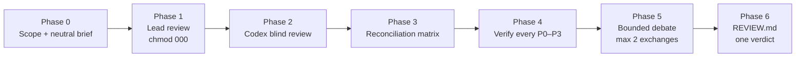
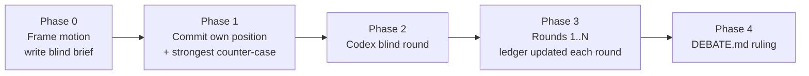
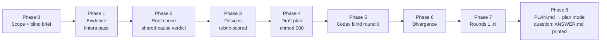

<div align="center">

# claude-codex-duo

**Claude Code and OpenAI Codex as an adversarial pair: blind two-model code review, structured debate, and evidence-only deep planning, with evidence on disk.**

[](LICENSE)
[](https://docs.anthropic.com/en/docs/claude-code)
[](https://github.com/openai/codex)
[](#safety-guarantees)

</div>

---

## Table of contents

- [Why](#why)
- [What is in the box](#what-is-in-the-box)
- [Prerequisites](#prerequisites)
- [Installation](#installation)
- [Quick start](#quick-start)
- [How it works](#how-it-works)
  - [codex-pr-review](#codex-pr-review)
  - [codex-debate](#codex-debate)
  - [codex-deep-plan](#codex-deep-plan)
  - [Reviewing uncommitted changes](#reviewing-uncommitted-changes)
  - [The monitored runner](#the-monitored-runner)
- [Artifacts](#artifacts)
- [Safety guarantees](#safety-guarantees)
- [Troubleshooting](#troubleshooting)
- [FAQ](#faq)
- [Contributing](#contributing)
- [License](#license)

---

## Why

A single model reviewing code tends to agree with itself. Asking the same model twice does not help, and asking a second model without discipline produces a second opinion with no way to tell who is right.

These plugins make the second model useful by forcing structure around it:

- **Blind first pass.** Codex forms its view from the code alone; it is never told another reviewer exists.
- **Every claim is checked.** Agreement between the two models is not evidence. Every finding of severity P0 to P3 is verified against the code, whoever raised it.
- **Written trail.** Every phase writes an artifact. The verdict follows from the ledger and a fixed policy, not from whoever spoke last.
- **The checkout is never modified.** Tracked files, the index, refs, stash and reflog are untouched by every plugin, including when reviewing uncommitted work: artifacts go outside the repository, local review adds only unreachable objects to `.git/objects`, and deep-plan writes one plan-mode plan file for Claude Code.

## What is in the box

| Plugin | Purpose | Entry point |
|---|---|---|
| **codex-pr-review** | Two-model code review of a PR, branch, commit range, or uncommitted local changes. Ends in exactly one merge decision. | `/codex-pr-review:review-pr <target> <base> "<intent>"` |
| **codex-debate** | Adversarial debate on any falsifiable motion or choice between named options: architecture decisions, migration plans, root-cause hypotheses, disputed review findings. | `/codex-debate:debate "<motion>" <mode> <rounds> [--seed <file>]` |
| **codex-deep-plan** | Evidence-only planning for GitHub issues, PR review comments, a single comment, or a plain request: cited facts, root causes, real fixes scored against workarounds, a blind Codex diagnosis and a bounded debate, at a depth that follows the request. A change request ends in one PR plan handed to Claude Code plan mode; a question ends in an evidence-backed answer. | `/codex-deep-plan:plan <issues \| pr N \| comment-url \| "request text" \| --request-file f>... [--slug <name>] [--rounds <1-3>] [--deep] [--solo] [--no-plan-mode]` |

All plugins also trigger from plain language ("review PR 123 with Codex", "debate with Codex whether ...", "plan a real fix for issues 12 and 13, no assumptions, and get Codex's take").

## Prerequisites

| Requirement | Notes |
|---|---|
| Claude Code | With plugins enabled |
| OpenAI Codex plugin | `claude plugin install codex@openai-codex`, then `/codex:setup` and log in. All plugins drive Codex through that plugin's companion script in its read-only sandbox. |
| `git`, `python3`, `node` | Standard tooling; macOS and Linux |
| `gh` | deep-plan fetches issues, PRs and comments with it; codex-pr-review resolves a PR number with it. Without it, paste the text with `--request-file` or review a branch, commit or local changes. |

Sending repository content to Codex means sending it to OpenAI. All plugins ask for confirmation that this is permitted for the repository before the first Codex call.

## Installation

```bash
claude plugin marketplace add hishamkaram/claude-codex-duo
claude plugin install codex-pr-review@claude-codex-duo --scope user
claude plugin install codex-debate@claude-codex-duo --scope user
claude plugin install codex-deep-plan@claude-codex-duo --scope user
```

Install only the ones you need; each plugin is standalone.

Update later:

```bash
claude plugin marketplace update claude-codex-duo
claude plugin update codex-pr-review@claude-codex-duo
claude plugin update codex-debate@claude-codex-duo
claude plugin update codex-deep-plan@claude-codex-duo
```

## Quick start

```text
# Review a GitHub PR; intent is taken from the PR body
/codex-pr-review:review-pr 123 main "PR body"

# Review a branch against main with an explicit spec
/codex-pr-review:review-pr feature/rate-limit origin/main "implements ADR-007 token bucket"

# Review a single commit against its parent
/codex-pr-review:review-pr 1965c8f6 1dfbaf4e "commit message of 1965c8f6"

# Review uncommitted work: staged, unstaged, deleted and untracked files
/codex-pr-review:review-pr local HEAD "settlement preflight for enable/disable"

# Have Codex attack a position
/codex-debate:debate "The per-tenant cache must be keyed by tenant+region, not tenant alone" challenge 3

# Compare named options; both sides argue blind first
/codex-debate:debate "Option A: Redis streams vs Option B: Postgres outbox for the job queue" compare 2

# Debate a disputed review finding, seeded with the review's verification record
/codex-debate:debate "F-01 stale replay is P1, not P2" hypothesis 2 \
  --seed /tmp/two-model-pr-review/<repo>/<run>/04-verification.md

# Plan one PR for three issues; a split is recommended if they do not share a root cause
/codex-deep-plan:plan 1128 1098 1097

# Plan the changes a PR review asked for (this plans, it does not review)
/codex-deep-plan:plan pr 45

# Plan from a single review comment, or from a request in your own words
/codex-deep-plan:plan https://github.com/o/r/pull/45#discussion_r123456
/codex-deep-plan:plan "add rate limiting to the export endpoint" --rounds 1
```

## How it works

### codex-pr-review



1. **Scope and brief.** Base and head are pinned to immutable SHAs. A neutral brief for Codex is generated deterministically by `build-brief.sh` before any finding exists; it contains the diff command, the alphabetical file list, the stated intent, the conventions, and the review rubric. It never mentions a second reviewer.
2. **Lead review.** Claude reviews in two passes (design, then implementation) against the rubric, writes its findings, and immediately sets the file to mode 000.
3. **Codex blind review.** A pre-flight asserts the lead file is unreadable, then the monitored runner launches Codex in a fresh thread, read-only, from the brief. Raw output and job metadata are kept verbatim.
4. **Reconciliation.** Every distinct finding from both sides is tabled as BOTH, CLAUDE-ONLY, CODEX-ONLY, or CONFLICT and given one canonical severity.
5. **Verification.** Each P0 to P3 finding and each CONFLICT is checked up an evidence ladder: quoted code, traced call path, executed test or repro. CODEX-ONLY findings get the same rigor as Claude's own.
6. **Bounded debate.** Only still-unverifiable or conflicting items go back to Codex, at most twice. Positions move only for new code-level evidence.
7. **Report.** `REVIEW.md` carries the verdict under an ordered, exclusive policy (BLOCK, REQUEST CHANGES, NEEDS CLARIFICATION, APPROVE WITH COMMENTS, APPROVE), merge conditions by finding ID, a disagreement log with job IDs, a false-positive appendix, and a coverage statement. Anything left unresolved is printed as a ready-to-run `/debate` line.

If Codex is unavailable the review continues as a single-model review, says so on line one, and never raises confidence to compensate.

### codex-debate



- **Motion discipline.** The motion must be a falsifiable statement or a choice between named options. Vague questions are rewritten and confirmed first.
- **Modes.** `challenge` (Codex attacks Claude's position), `compare` (named options, both sides argue independently before seeing each other), `hypothesis` (root-cause debate against a failure).
- **Claim ledger.** Every claim has an owner, an ID, an evidence grade (E0 executed, E1 quoted trace, E2 cited document, E3 reasoning, E4 assertion) and a status. E4 claims can never decide a ruling.
- **Rules that bind both sides.** Positions move only for new evidence. Contested checkable facts are checked, not argued. Conceding to end the debate is a logged failure.
- **Ruling.** UPHELD, OVERTURNED, REFINED, UNRESOLVED, or NO DEBATE, with mandatory sections for Claude's own concessions and the strongest surviving argument against the ruling.

### codex-deep-plan



- **Inputs.** Any mix of GitHub issues, pull requests (their review comments become the work items), single issue or PR comments, quoted request text, or a file. `init-plan.sh` pins the base SHA and stores every input verbatim; input text is a claim, never a fact.
- **Facts only, mechanically.** Every claim carries `[FACT]`, `[VERIFIED]`, `[INFERENCE]` or `[UNKNOWN]`. `check-citations.py` resolves each `path:lines@sha` with `git show` and string-matches the quote; `lint-claims.py` rejects hedge words outside inferences, facts without citations and decisions without an evidence id. No design decision may rest on an inference; an isolated `fact-checker` agent promotes inferences without seeing the reasoning behind them.
- **Root causes, real fixes.** Each chain must end in a violated invariant, missing abstraction, wrong domain model, broken contract, absent constraint or incorrect authoritative content (the source-of-truth text is wrong, so the edit is the fix). In standard and deep runs designs are scored on five gates (mechanism, universality, structural invariant, deletion, regression proof) with blast radius, reversibility, verifiability and cost-of-being-wrong as counterweights; do-nothing, the largest correct change and the tempting workaround are always scored and the chosen design must beat each in writing; light runs skip scoring. "One PR" is a hypothesis: a split is recommended when the inputs do not share a mechanism.
- **Blind second model.** Round 0 gives Codex only the inputs, the base SHA and the in-scope paths; the brief is generated before any evidence exists and the builder refuses wording that reveals another analysis. Codex returns its own root causes, designs and single-PR verdict as JSON. `validate-verdict.py` enforces the objection contract (evidence, falsifier, proposed change), rejects praise and evidence-free concessions, makes a bare APPROVE require an adversarial attempt, and checks Codex's sha-pinned citations against the code.
- **Bounded debate.** Default 2 rounds, 3 with `--deep`, hard cap 3. The protocol stops at the first condition met, in this order: T0 light or question settled on round 0, T1 converged, T4 a blocker that needs a human choice, T2 cap, T3 no new information for two rounds, T5 Codex unavailable (plan stamped `SOLO`, never simulated); `debate-status.py` evaluates T1–T4, the run records T0 and T5.
- **Proportionate depth.** Phase 0 classifies the request. A *question* ("is the README current?") gets `ANSWER.md`: evidence, one blind Codex look, a verdict, and any defects found, with no plan. A *content correction* (documentation, wording, config values that are the source of truth) runs *light*: evidence for the edited lines, the direct correction as the fix (cause class `incorrect_authoritative_content`; a checker is at most an optional follow-up), one blind Codex round, a short plan. Anything with reported behaviour runs *standard*; `--deep` or several issues run everything. Light is provisional: it escalates after the evidence phase or after Codex's round if the content is generated or duplicated, or an accepted objection or new evidence requires a change beyond the edit.
- **Handoff.** `PLAN.md` carries only what an approver acts on — summary, root cause → change → test → closure, file-by-file plan, tests, order and rollback — and is copied verbatim into a Claude Code plan-mode plan for approval. Candidate scoring, risks, unknowns and the debate closure live in `PLAN-EVIDENCE.md` beside it, with the artifact directory as the source of record. `--no-plan-mode` prints it instead. The plan-mode tools are built in but not a documented skill contract; if no plan file path is offered the skill prints the plan.

### Reviewing uncommitted changes

Passing `local` (or `worktree`) as the target reviews the working tree as it is, without committing or stashing:

- The builder captures staged, unstaged, deleted, renamed and non-ignored untracked files into a single git **tree object** through a scratch index that lives in the artifact directory, never in the repository. The repository's own index, refs, stash, reflog and files are untouched; the only side effect is unreachable objects in `.git/objects`.
- The brief's diff command becomes `git diff <base> <tree>`; Codex reads files exactly as reviewed with `git show <tree>:<path>`.
- Base defaults to `HEAD`. A clean tree stops with "nothing to review".
- The tree is resolved immediately before and after the Codex run, and recaptured at the end. If it changed, the report names the files edited during the review.

### The monitored runner

Every Codex call goes through `scripts/codex-run.sh`, which wraps the Codex plugin's background task mode:

| Behaviour | Detail |
|---|---|
| Background execution | Never a foreground call, so long reviews cannot be killed by shell timeouts |
| Liveness | Polls job status and the worker process; a dead worker with a "running" job is detected and cancelled |
| Stall and timeout | Configurable (`--stall-min`, `--max-min`); a stall or timeout cancels the job, then verifies the cancel by re-reading job status and looking for a live worker. An unverified cancel is reported, never asserted. |
| Evidence | Raw stdout, stderr, job log, progress and metadata (job ID, thread ID, timings, last error) saved as sidecars; retries rotate to `.attemptN.*` |
| Refusals | Exits immediately if `--write` is requested |
| Probe | `--probe` checks the Codex plugin is installed, logged in and ready before a review spends any effort |

Exit codes: `0` completed, `1` failed, `2` stalled, `3` timeout, `4` launch error or invalid invocation, `5` stalled or timed out with the cancel unconfirmed. A bad command line never exits 1, so a typo cannot be mistaken for an upstream failure, and `5` means do not retry because a worker may still be running.

## Artifacts

Everything is written outside the repository:

```text
/tmp/two-model-pr-review/<repo>/<target>-<timestamp>/
  00-scope.md  00-brief.md  01-lead.md  02-codex.md (+ .stdout .stderr .joblog .meta)
  03-matrix.md  04-verification.md  05-debate.md  REVIEW.md

/tmp/codex-debate/<repo>/<motion-slug>-<timestamp>/
  00-frame.md  01-claude-position.md  02-codex-blind.md  03-round-<k>.md  DEBATE.md

/tmp/deep-plan-duo/<repo>/<slug>-<timestamp>/
  meta.json  inputs/<kind>-<id>.md  00-scope.md  01-evidence.md  02-root-cause.md  03-designs.md
  04-plan-draft.md  05-disagreements.md  debate/r<n>-prompt.md  debate/r<n>-codex.{json,stdout,meta,...}
  debate/divergence.md  PLAN.md + PLAN-EVIDENCE.md | DECISION-REQUIRED.md | ANSWER.md
```

Each artifact ends with a `STATUS: PHASE <n> COMPLETE` line; a run resumes at the first missing artifact.

## Safety guarantees

- **Read-only.** No plugin modifies, formats, stages, stashes, commits or restores tracked files, and Codex is never invoked with `--write`. `git status` must match the starting baseline at the end of every run.
- **Untrusted input.** Repository content, PR text and Codex output are treated as data, never as instructions.
- **No fabricated evidence.** A command that did not run is never reported as run; failures are reported verbatim.
- **Blindness is procedural, not structural.** Codex's sandbox can read `/tmp` and Claude Code session transcripts. What keeps the second review blind is that Codex is never told a first review exists, that Claude's findings are written before any Codex contact, and that they sit at mode 000 while Codex runs. Reports say exactly this and never claim more.

## Troubleshooting

| Symptom | Cause and fix |
|---|---|
| `PROBE` reports UNAVAILABLE | The Codex plugin is not installed or not logged in. Run `/codex:setup`. |
| Runner exit `5` | The job stalled or timed out and the cancel could not be confirmed. Do not retry; check the job with the companion's `status` command, because a worker may still be running. |
| Runner exit `2` (STALLED) | No job-log activity for `--stall-min` minutes. Check the `.joblog` sidecar; upstream capacity errors are recorded in `.meta` as `last_error`. Rerun; attempts rotate. |
| Runner exit `3` (TIMEOUT) | Review exceeded `--max-min`. Large diffs should be split by subsystem in Phase 0. |
| "nothing to review" in local mode | The working tree equals the base tree. Make a change or pick a different base. |
| Builder refuses `--out` | The artifact directory must be outside the repository so the scratch index cannot leak into the snapshot. |
| Tests fail inside a monorepo repro | Build workspace dependencies first; stale `dist` output is the usual cause. |
| `init-plan.sh` exits `3` | `gh` is missing, not logged in, or the issue/PR could not be fetched. The message names the input; paste its text with `--request-file` or run `gh auth login`. |
| `build-prompt.sh` exits `3` (LEAK) | The in-scope paths in `00-scope.md` contain wording that would reveal another analysis to Codex. Reword the scope file; never edit the brief by hand. |
| `validate-verdict.py` FAIL | Codex's reply broke the objection contract (no evidence, no falsifier, praise, a fabricated citation). The skill retries once with the reasons appended, then continues `SOLO` for that round. |
| Deep plan says SPLIT | The inputs do not share a root cause or change surface; forcing them into one PR would be a workaround of the review process. Run it per group, or say the split is acceptable. |

## FAQ

**Does the debate plugin need the review plugin?** No. It debates any motion. `--seed` is an optional way to import a review's verification record.

**Can I use a Claude subagent instead of Codex?** No. All plugins refuse to simulate the second model; a same-model second opinion is exactly the failure mode they exist to avoid.

**Why does the deep plan run outside plan mode and only enter it at the end?** Plan mode blocks every write except the plan file, and the skill has to write artifacts, run linters and launch 10–30 minute Codex jobs. It finishes the work, then enters plan mode with `PLAN.md` verbatim so you approve the same document that carries the evidence.

**Does local mode work on Windows?** Untested. macOS and Linux are supported.

**Where do secrets go?** Nowhere. Briefs never contain credentials, and the read-only sandbox prevents Codex from writing anything back.

## Contributing

See [CONTRIBUTING.md](CONTRIBUTING.md). Run `bash scripts/validate.sh` before opening a PR; CI runs it too. Changes must keep all plugins read-only and must not add any wording that would tell Codex a second reviewer exists.

## License

[MIT](LICENSE)
